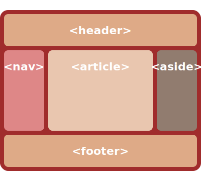

# FlexBox Part 2

## Changing Orientation

1. Experiment with changing the container's orientation to each of the four values:
	1. `row`
	2. `column`
	3. `row-reverse`
	4. `row-reverse`

## Line Wrapping

1. Set the container to line wrap. Does this change anything, even if you resize the window?
2. Set each item (use class `box`) to `min-width: 200px;`. What changes?
3. Try setting the container to `flex-wrap: wrap-reverse`. What happens now?


## Display Order

1. Set box 5 to a higher order than 1. Where does it appear?
2. Make boxes 3 and 2 appear later still.
3. Inspect the elements in the developer tools.
   Has the display ordering changed the DOM?

## Display Order -- Part 2

Suppose you wanted to achieve a classic three-column layout like this:



However, the source order is as in the HTML below.
How would you use FlexBox to correct this?
Implement your answer.


``` .html
<header>...</header>
<main>
   <article>...</article>
   <nav>...</nav>
   <aside>...</aside>
</main>main>
<footer>...</footer>
```

---
## Justify Content

1. Open your `justify.html` file from earlier in a browser.
2. Inspect the container div.
3. Add a new CSS rule, enter `justify-content` and hit tab.
   A menu should appear (below).
4. Use the cursor keys to move up and down through the values to explore the effects they have.


---
## Align Items

1. Modify your `justify.html` file:
	- Make the container's height 200px.
	- Make the heights of any three items different (say 30px, 70px and 100px).
2. Open your file in a browser.
3. Again using the developer tools, add to the container a property `align-items` and hit tab.
4. Cycle through the properties using the arrow keys and observe the effect.
